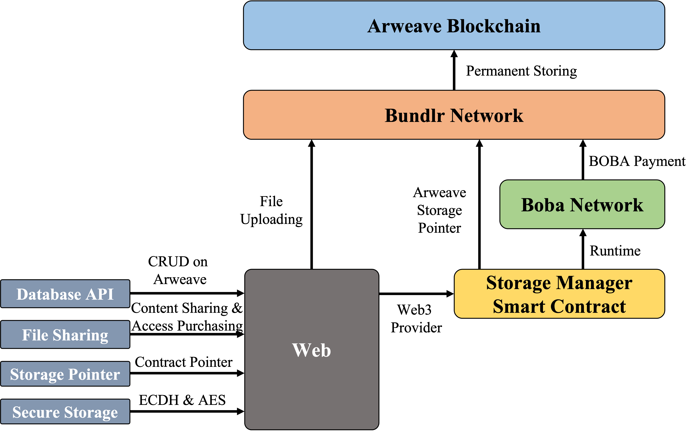

# Boba, Bundlr & Arweave

a POC can allow users to interact with Arweave with just their BOBA wallet, powered by Bundlr Network.

As we can see, this figure illustrates the main architecture of our application. Basically we want to provide database-alike API for developers to CURD (Create, Update, Read, Delete). To achieve that, we deployed a smart contract on BOBA network named `ArweaveStorageManager` (V2), which acts like a storage pointer that points to the file ID stored in Arweave. Moreover, we implement full encryption to this workflow so the uploaded data can only be read by authorized wallets. What’s more, based on Database API, Encryption and our ArweaveStorageManager Contract, we go one step further, and achieves a POC for cloud drive, meaning users can create contents, sharing them to others and possibly making profits on it.

## Updates

This application is now integrated with both `Login with Unstoppable` and `Domain resolution` feature.

Youtube Demo: https://youtu.be/qSuwgBAgkG0

Contact me: Discord handle: Soptq#9775 UD Email: aplenty$dot$brier-0i$at$icloud$dot$com

## Features:
- Storage Pointer: Using contract as a pointer that points to the actual file ID. Instead of using file ID to retrieve file on Arweave, users can now query the contract for the latest file ID, and then getting file.  Thus, data can be modified at will on Arweave.
- Database API: Simple and intuitive CRUD API for developers to read and write data on Arweave.
- Secure Storage: ECDH and AES are used to encrypt and decrypt data for better user experiences, performance and security.
- File Sharing: users can share their files to others, possibly making profits.

Live Version: https://hack-boba-bundlr-arweave.vercel.app/

Youtube demonstration: https://youtu.be/tbVjToh6pA4

## Installation

1. Fork this repo.
2. `yarn install` to install dependencies.
3. `yarn start` to start a local server
 

## Notes

Feel free to open an issue if there is any problem.
